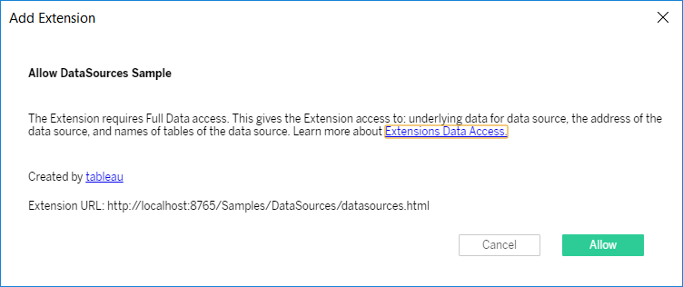
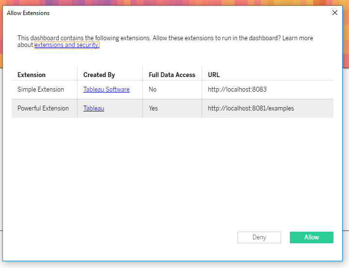
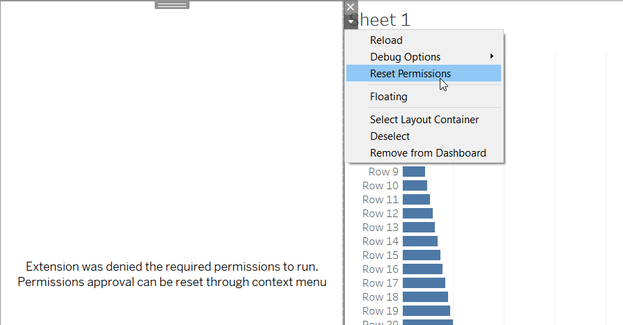

Starting in Tableau 2020.2, Tableau introduced a data model that supports flexible table relationships. To support this new model, the Extensions API version 1.4 provides new APIs that support the data model.
Because the data model changes the way the underlying data can be stored, some of the existing APIs will no longer work.
For more information about the data model in Tableau, see [The Tableau Data Model](https://help.tableau.com/current/pro/desktop/en-us/datasource_datamodel.htm).

## What happens when extensions access full data

As a developer, you can choose the features and capabilities to implement using the Extensions API. One of these is the ability of the extension to access the underlying data in the dashboard or workbook. The `Worksheet` and `Datasource` interfaces have methods that return (as a promise) data tables containing the underlying data of the workbook or data source. The `Datasource` interface has additional methods, `getLogicalTablesAsync()`, `getActiveTablesAsync()` (Deprecated), and `getConnectionSummariesAsync()` that return the names of the active tables and fields in the data source, and the summary descriptions of the data source connections.

There are many cases where you need access to this underlying data so that your extension can perform a useful function. The only requirement for access is that the users of your extension are aware of it.
If the extension uses any of the four methods, they are considered privileged, in that they require access to underlying data and data source information. To use any one of them, you need to add a declaration to your extension's manifest file (`.trex`) that states the extension requires **full-data** permission. Tableau uses this declaration to provide a prompt to users at run time that gives them the option of allowing this access or not. 

---

#### Extensions API methods that access full data 

If your extension uses any one of the following methods, without declaring **full-data** permission in the manifest file, the extension will load but the method call will fail. If you have debugging enabled, Tableau will report an error in the JavaScript console and the error is also written to the Tableau log file.

| Method | Current Status |
|------------------------------------------|-------------------------------------|
|`Worksheet.getUnderlyingTablesAsync()`    | |
|`Worksheet.getUnderlyingTableDataAsync()` | |
|`Worksheet.getUnderlyingDataAsync()`      | Deprecated starting with the v1.4 library |
|`Datasource.getLogicalTables()`           |  |
|`Datasource.getLogicalTableData()`        |   |
|`Datasource.getUnderlyingDataAsync()`     | Deprecated starting with the v1.4 library |
|`Datasource.getActiveTablesAsync()`       | Deprecated starting with the v1.4 library |
|`Datasource.getConnectionSummariesAsync()`| |


If you use any of these APIs, you need to add a `<permissions>` element to the manifest file (`.trex`) and specify **full-data** permission. The declaration will allow the extension to pass validation. Depending upon the situation, for example, the first time a user adds the extension, Tableau will prompt the user to allow or deny the extension to run.

---

## Add permissions to access full data to manifest file

To access the underlying data along or information about the data source, the extension must declare that it requires full data access in the extension manifest file (`.trex`).

The `<permissions>` element you add looks like the following: 

```xml
<dashboard-extension>
...
<icon>
...
</icon>
<permissions>
    <permission>full data</permission>
</permissions>
</dashboard-extension>
```

The `<permissions>` element must be added under `<dashboard-extension>` immediately following the `<icon>` element. For a complete description of the manifest, see the [Tableau Extensions Manifest File]({{site.baseurl}}/docs/trex_manifest.html).

If full data is not declared in the manifest file, and the extensions calls one of the APIs that accesses any underlying data or data source information, the API call fails. In addition, an error is written to the Tableau log file (`log.txt`). If you are debugging the extension with the Chromium web browser, an error is reported the console pane. The error message would look similar to the following:

```cli
PermissionValidation.ts:26 Extension (name = DataSources Sample, ID = com.tableau.extensions.demo.local) is missing required permission: full-data
Error: internal-error: permission-denied: Missing required permission to run get-underlying-data(...)

```

---

## What happens when users add your extension

When users add an extension that requires full-data access, Tableau displays a prompt that provides the name of the extension, the URL of the extension, and brief description about the access that the extension has to the data in the workbook. Users can click **Allow** to load the extension. If a user clicks **Cancel**, the extension is not loaded and the user returns to the **Choose an Extension** dialog box.



The name of the extension and its URL come from the values you add to the manifest file for the extension. These are the values you add for `<name>` and the `<url>` element under `<source-location>`.  

---

## What happens when users open a workbook that uses an extension

When users open a dashboard that has an extension that requires full-data access, Tableau displays a prompt that lists the names of the all the extensions in the dashboard. Users can click **Allow** to load the dashboard.




The **Allow an Extension** dialog box provides users information about your extension. This information includes links to your website, as specified by the `website` attribute in manifest file (in the `<author>` element). Users can click on the link under **Created By** to find out more about your extension.
 The dialog box also indicates whether or not the extension requires full-data access and provides the URL of the extension.

If a user clicks **Cancel**, the workbook is opened, but the extension is not loaded. In the layout container where the extension would normally appear, the following message appears:

```cli
Extension was denied the required permission to run.
Permissions approval can be reset through the context menu.

```

Users can use choose to allow the extension to run by using the clicking **Reset Permissions** from the **More Options** drop-down menu of the layout container. This opens up the **Allow Extensions** dialog box where the user can change permissions for the extension.


