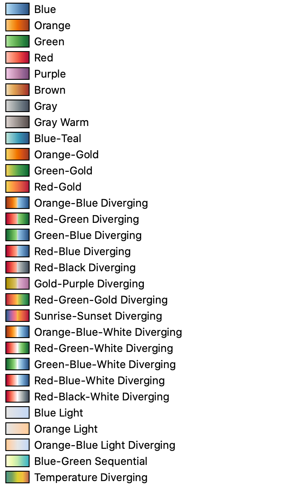
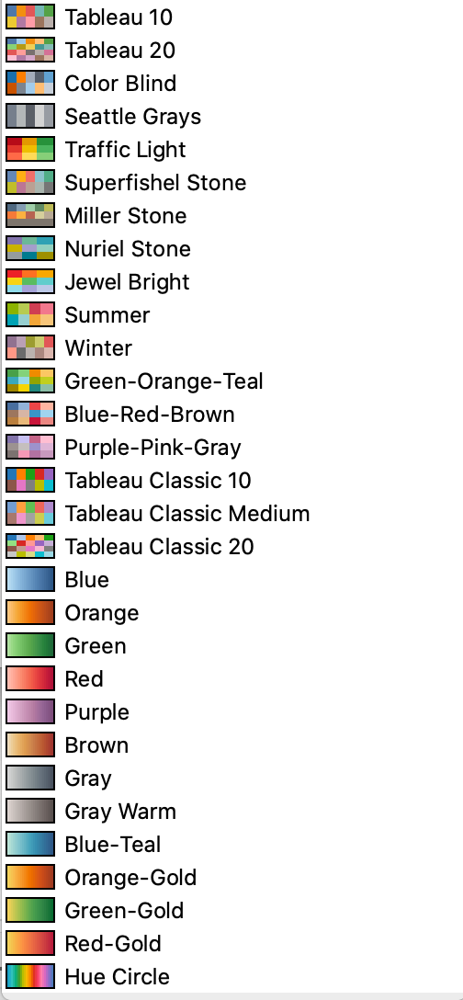

## Description of `inputSpec` (version 1) properties

The following table describes the properties in the `inputSpec`, the JavaScript object that you provide as input to the `createVizImageAsync` method.

### `description`

(Optional)    A description about the visualization. Currently, the description is not used anywhere and is not visible when the image is generated. However, it might be helpful to use this description as you comment your code.

### `title`

(Optional)    Creates a title for the image.

```javascript
title: "My Custom Viz", 

```

### `data`

(Required) The data to use to create the image. The `data` consists of an array of objects, specified with the `"values"` property. Data is listed in row level order, where each object represents one item.

```javascript
data: {
  values: [
   { Category: 'A', Sales: 28 },
   { Category: 'B', Sales: 55 },
   { Category: 'C', Sales: 43 },
   { Category: 'D', Sales: 91 },
   { Category: 'E', Sales: 81 },
   { Category: 'F', Sales: 53 },
   { Category: 'G', Sales: 19 },
   { Category: 'H', Sales: 87 },
   { Category: 'I', Sales: 52 }
  ]
},

```

### `mark`

(Optional) Supported mark types include: `tableau.MarkType.Bar`, `tableau.MarkType.Line`, `tableau.MarkType.Area`, `tableau.MarkType.Square`, `tableau.MarkType.Circle`, `tableau.MarkType.Text`. If no mark type is specified, the generated image will use the Tableau default for that data.


### `markcolor`

Specifies a mark color for all marks, for example, hex values. This is equivalent to selecting an arbitrary color in the Color Shelf of the Marks card in Tableau.

```javascript
 markcolor: "#FFA500",

```

### `size`

(Optional) Specifies the size of the image in pixels. The size is described with width and height dimensions.

| Property |  Value |
|:--- |:--- |
|`width` | Width of the SVG image. |
|`height`| Height of the SVG image.|
|`showlegend` | Boolean (`true`, `false`). Specifies whether to show or hide the Size legend. |

If you specify the size, you must specify both the width and height. If you don't specify a size, the image uses the default size (600 x 400).

```javascript
size: {width: 800, height: 600},

```

### `encoding`

Corresponds to the Marks card in Tableau and describes how the marks (measures and dimensions) are encoded. In Tableau, when you drag fields onto the properties on the Marks card it encodes the data in the view. The `encoding` property lets you set the properties of the marks for the image. <br/> The `columns`, `rows` properties allow you to define the layout of your view, just like you do in Tableau today. You can also map fields to the `color`, `size`, and `text` properties. 
Within these properties, you must specify the field to encode and its type (`tableau.VizImageEncodingType.Continuous` or `tableau.VizImageEncodingType.Discrete`). Some properties allow you to set additional values as shown in the following table.

---

#### encoding: `columns` and `rows`

| Property |  Value |
|:--- |:--- |
|`field` | The name of the field to encode. |
|`type`| The type of field, either `tableau.VizImageEncodingType.Discrete` (blue "pill") or `tableau.VizImageEncodingType.Continuous` (green "pill"). |
|`hidden` | Boolean (`true`, `false`). Specifies whether to show or hide the column or row header. |
| `showgridline` | Boolean (`true`, `false`). Specifies whether to show or hide the gridlines. |
|`title` | Specifies a custom axis title (x-, or y-axis) for the columns and rows. A `title` can only be used for continuous fields (`tableau.VizImageEncodingType.Continuous`). Custom titles for discrete fields are not supported. |
| `showtitle` | Boolean (`true`, `false`). Specifies whether to show or hide the custom column or row title. |

The following are examples of how you might specify the encodings for columns and rows:

```javascript

encoding: {
  columns: {field: "Sales", type: tableau.VizImageEncodingType.Continuous, title: "My Custom Title", showtitle: true},
  rows: {field: "Category", type: tableau.VizImageEncodingType.Discrete  }
} 

```

```javascript
mark: tableau.MarkType.Line,
  encoding: {
    columns: {field: "Category", type: tableau.VizImageEncodingType.Discrete, showgridline: true},
    rows: {field: "Measure", type: tableau.VizImageEncodingType.Continuous, showgridline: true},
  }
```

#### encoding: `size`

Specifies the size encoding of the mark. The `size` property corresponds to the Size button on the Marks card. For continuous fields, you can set the bar mark to either manual or fixed size. You can also set the mark’s alignment.

| `size` Property |  Value |
|:--- |:--- |
|`field` | The name of the field to encode. |
|`type`| The way the data is distributed in the view (discrete or continuous).|
|`setting` | For continuous fields of the bar mark type, specifies the size and alignment properties of a mark.   The options are manual (`tableau.VizImageSizeSettingType.Manual`) or fixed size (`tableau.VizImageSizeSettingType.Fixed`). For manual, you can specify a `size` value from `0` to `2`. For fixed, you can set the alignment and width in axis units. See the `setting` properties for more information. |
|`showlegend` | Boolean (`true`, `false`). Specifies whether to show or hide the color legend. |


|`setting` Property |  Value |
|:--- |:--- |
|`tableau.VizImageSizeSettingType.Fixed` | Mark size is fixed. When `Fixed` is selected, you can set the `alignment` to `tableau.VizImageSizeSettingAlignmentType.Right`, `tableau.VizImageSizeSettingAlignmentType.Left`, or `tableau.VizImageSizeSettingAlignmentType.Center`. You can set the `width_in_axis_units` to a fixed number of units (floating point values accepted). |
|`tableau.VizImageSizeSettingType.Manual` | Specifies that the mark size type is manual. When this is selected, set the `marksize` value (from 0 to 2, floating point values accepted). |

Example of fixed sized type:

```javascript

encoding: {
    ...
    size: {field: "Age", setting: tableau.VizImageSizeSettingType.Fixed, alignment: tableau.VizImageSizeSettingAlignmentType.Right, width_in_axis_units: 3}

  } 
```

Example of manual sized type:

```javascript
encoding: {
    ...
    size: {field: "Measure", type: tableau.VizImageEncodingType.Continuous, setting: tableau.VizImageSizeSettingType.Manual, marksize: 0.35}
  }
```

#### encoding: `sort`

Specifies the sort order for a field (continuous or discrete). Supports sorting the field by ascending or descending values (`VizImageSortDirectionType.Ascending`, `VizImageSortDirectionType.Descending`), based on the `sortby` criteria you provide.

```javascript
  sort: { field: "Category", sortby: "Weather", direction: tableau.VizImageSortDirectionType.Ascending }
  ```

#### encoding: `color`

The `color` property corresponds to the Color button on the Marks card. The color can contain additional properties:

| Property |  Value |
|:--- |:--- |
|`field` | The name of the field to encode. |
|`type`| The way the data is distributed in the view (discrete or continuous).|
|`palette` | Specifies color encoding for the field from the Tableau palette. Note that there are separate palettes for discrete or continuous fields. You can also create custom color palettes for continuous fields. See [Create Custom Color Palettes](#create-custom-color-palettes). |
|`showlegend` | Boolean (`true`, `false`). Specifies whether to show or hide the color legend. |

**`palette` names for continuous fields**

You can specify one of the following Tableau color palettes with the `palette` property for continuous fields. Note that the list of available palettes depends upon the version of Tableau that is being used. Be aware that the palette colors are subject to change.

The following is an example that shows how you might encode a continuous field with a Tableau palette. You can also create custom color palettes for continuous fields. See [Create Custom Color Palettes](#create-custom-color-palettes).

```javascript

encoding: {
   ...
   color: { field: 'Measure', type: tableau.VizImageEncodingType.Continuous, palette: 'green_blue_white_diverging_10_0'},
   ...
}

```

| Continuous colors palettes |  Palette name |
|:--- |:--- |
|  | `blue_10_0` <br/>  `orange_10_0` <br/> `green_10_0` <br/> `red_10_0` <br/> `purple_10_0` <br/> `brown_10_0` <br/> `gray_10_0` <br/> `gray_warm_10_0` <br/> `blue_teal_10_0` <br/> `orange_gold_10_0` <br/> `green_gold_10_0` <br/> `red_gold_10_0` <br/> `orange_blue_diverging_10_0` <br/> `red_green_diverging_10_0` <br/> `green_blue_diverging_10_0` <br/> `red_blue_diverging_10_0` <br/> `red_black_10_0` <br/> `gold_purple_diverging_10_0` <br/> `red_green_gold_diverging_10_0` <br/> `sunrise_sunset_diverging_10_0` <br/> `orange_blue_white_diverging_10_0` <br/> `red_green_white_diverging_10_0` <br/> `green_blue_white_diverging_10_0` <br/> `red_blue_white_diverging_10_0` <br/> `red_black_white_diverging_10_0` <br/> `tableau-blue-light` <br/> `tableau-orange-light` <br/> `tableau-orange-blue-light` <br/> `tableau-map-blue-green` <br/> `tableau-map-temperatur`  |


**`palette` names for discrete fields**

You can specify one of the following Tableau color palettes with the `palette` property for discrete fields. Note that the list of available palettes depends upon the version of Tableau that is being used. Be aware that the palette colors are subject to change.

The following is an example that shows how you might encode a discrete field with a Tableau palette.

```javascript
encoding: {
   ...
   color: { field: 'Category', type: tableau.VizImageEncodingType.Discrete, palette: 'seattle_grays_10_0'},
   ...
}

```

| Discrete color palettes |  Palette name |
|:--- |:--- |
|  |  `tableau10_10_0` <br/> `tableau20_10_0` <br/> `color_blind_10_0` <br/>`seattle_grays_10_0`<br/>`traffic_light_10_0` <br/>`superfishel_stone_10_0` <br/>`miller_stone_10_0` <br/>`nuriel_stone_10_0`<br/>`jewel_bright_10_0`<br/>`summer_10_0`<br/>`winter_10_0`<br/>`green_orange_cyan_yellow_10_0`<br/>`blue_red_brown_10_0`<br/>`purple_pink_gray_10_0`<br/>`tableau-10`<br/>`tableau-10-medium`<br/>`tableau-20`<br/>`blue_10_0`<br/>`orange_10_0`<br/>`green_10_0`<br/>`red_10_0`<br/>`purple_10_0`<br/>`brown_10_0`<br/>`gray_10_0`<br/>`gray_warm_10_0`<br/>`blue_teal_10_0`<br/>`orange_gold_10_0`<br/>`green_gold_10_0`<br/>`red_gold_10_0`<br/>`cyclic_10_0` |

---


#### Create custom color palettes

You can set the color palette to a custom diverging or custom sequential color palette that you specify, and not just the Tableau defined palates, such as, `green_blue_white_diverging_10_0`.


| Custom Palette Property |  Value |
|:--- |:--- |
|`tableau.VizImagePaletteType.CustomDiverging` | Defines a custom diverging palette. Specify the `start` value and an `end` value, each as a hexadecimal value. |
| `tableau.VizImagePaletteType.CustomSequential` | Defines a custom sequential palette. Specify the `end` value as a hexadecimal value. |

For example, you could set a custom palette as shown in the following examples:


  ```javascript

    palette: tableau.VizImagePaletteType.CustomDiverging, start: "#FFB6C1", end: "#90ee90"

  ```

  Or

  ```javascript

   palette: tableau.VizImagePaletteType.CustomSequential,  end: "#FFB6C1"

  ```
