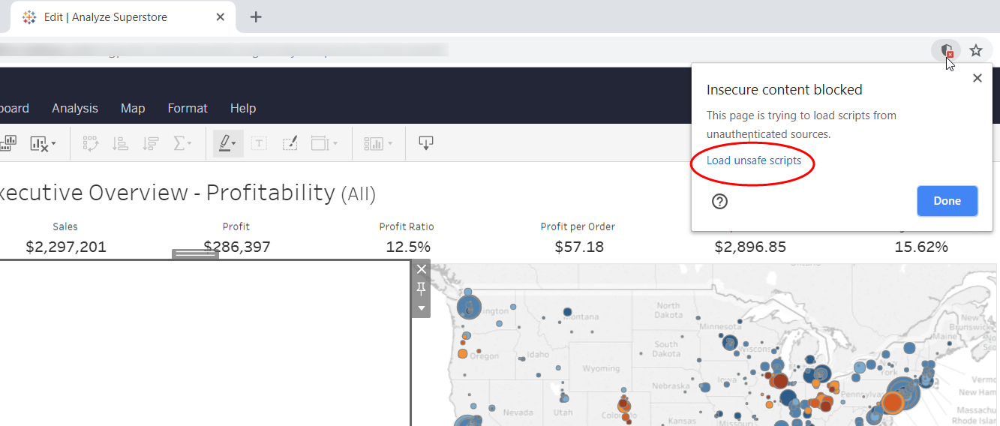

A viz extension is a web app inside of a worksheet on Tableau Server and Tableau Cloud. If you add an extension to a worksheet in web authoring, or publish a worksheet that contains a viz extension to Tableau Server or Tableau Cloud, you can debug the extension using the debugging tools that are built into the browser that you are using.

The following section describes how you could debug your extension using Chrome. The same principles generally apply if you are using other browsers and their developer tools. For more information about the Chrome developer tools, see [Chrome DevTools](https://developers.google.com/web/tools/chrome-devtools/). For more information about debugging JavaScript with the DevTools, see [Debug JavaScript](https://developers.google.com/web/tools/chrome-devtools/javascript/).  

---

## Open the debugging tools in the browser

1. Open the workbook containing the extension in Tableau Server or Tableau Cloud.
   <br/>**Note:** If the extension fails to load and you are using `localhost` to serve your extension, you might encounter the mixed content security setting. To get past this issue, see [Load and view localhost content on sites that use secure connections](./trex_viz_debug_server.html#load-and-view-localhost-content-on-sites-that-use-secure-connections).

2. Open the debugging tools. <br/>
The process varies by browser. If you are using Chrome, enter **CTRL** + **SHIFT** + **i** (Windows) or **COMMAND** + **OPTION** + **i** (MacOS). 

3. Locate the source code for your extension. <br/>
For example, if you were using Chrome for debugging, you can open the Source pane. Under folders shown on the navigation pane, you will find one for the extension. For example, you might see something like `extension_frame_37 (connectedScatterplot.html)`.
Under this, you will find the name of the server (for example `localhost`), and you can drill down to your JavaScript source files.

---

## Set breakpoints and explore the code

If you need to debug your extension, setting a breakpoint in your source code is a good way to get started. When the breakpoint is hit, the code execution is paused in the debugger. You can then use the debugger controls to step through your code. You can use the debugging tools to see the values of local variables, and the call stack. You can also hover over in-scope variables in source window and see the current values.

1. Locate the line in your source code and set the breakpoint. 
<br/>For example, you want to set this early in your code after the `initializeAsync()` function call.

2. Refresh or reload the browser window. <br/> 
You might see the permission dialog box prompt as the extension gets loaded.

3. Step through your code or set other breakpoints. <br/>
You can examine variables to see what information the extension has access to. For example, if you step or stop on the source line where you have access to the worksheet object, you can examine the values of the available resources in the worksheet.

    ```javascript/
    // To get filter info, first get the worksheet.
    const worksheet = tableau.extensions.worksheetContent.worksheet;
    ```

---

## Debugging during initialization

If you need to troubleshoot or debug issues that prevent your extension from loading or initializing on Tableau Server or Tableau Cloud, you can set breakpoints that trigger when your JavaScript code is loaded.

1. In the Chrome browser, select **Event Listener Breakpoint > Script > Script First Statement**. <br/>
After you select the event breakpoint and refresh or reload the browser window, code execution will stop when every script is loaded.

2. Reload or refresh the browser. <br/>

3. In the debugger, click **Continue** to get to your JavaScript code.<br/>
You might need to click **Continue** many times, as code execution stops for all the scripts in the worksheet.

If your extension fails to load at all on Tableau Server or Tableau Cloud, check the console window of the debugger to see if there is an error message of some kind. The console messages can give you clues about where to begin investigating when something goes wrong. If the error is caused by mixed content (trying to load an HTTP web page inside of a secure HTTPS server), see [Load and view localhost content on sites that use secure connections](#load-and-view-localhost-content-on-sites-that-use-secure-connections).

---

## Load and view localhost content on sites that use secure connections

*Mixed Content Warning*

If you want to test and debug your extension (running on `http://localhost`) with Tableau Cloud, or with a Tableau Server site that is using HTTPS, you might find that your extension fails to load. You won't see any error message in the worksheet if this happens. There will just be an empty `iframe` where the extension should appear. The reason for this is that the default settings of many browsers blocks the extension from loading because the extension is not using a secure connection (HTTPS).

To temporarily get around these safety settings for the session, you can click the shield icon (or lock icon) in the browser's address bar. The alert dialog box will allow you to either load the scripts, or allow you to view the full content of the page. As soon as you load the unsafe scripts or allow the blocked content, the extension will load and will continue to be available for the duration of your session. Be sure to close the browser completely when you are finished testing. The following example shows what you might see in Chrome.
<br/>



During the session, anytime you refresh or reload the web page, you will see the extensions dialog box requesting permission to run. And in the debugger console, you might see a warning message about mixed content.

```bash
Mixed Content: The page at 'https:/some_URLs#4' was loaded over HTTPS, but requested an insecure resource 'http://localhost:8765/Samples/Filtering/filtering.html'. This content should also be served over HTTPS.


``````
