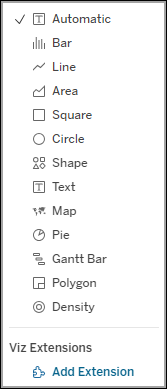
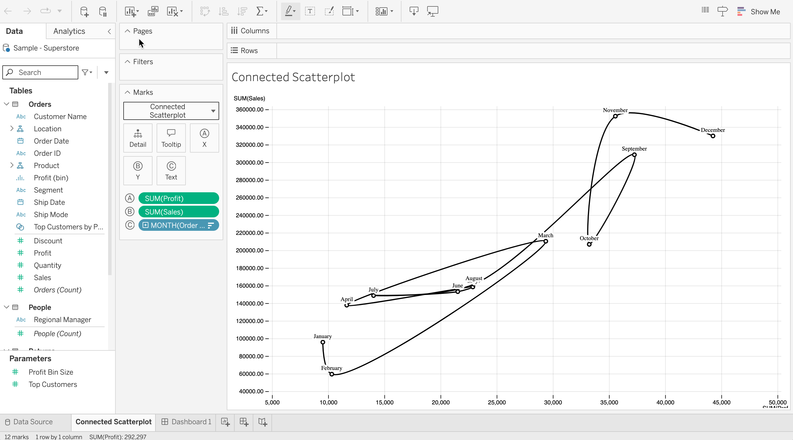

The Tableau Viz Extensions API allows developers to create new viz types that Tableau users can access through the worksheet Marks card. Like Dashboard Extensions, Viz Extensions are web applications that can interact and communicate with Tableau. Developers will be able to build bespoke Viz Extensions that can be made available to Tableau users through the Tableau Extensions API.

This section will take you through the process of setting up your environment to use one of the sample viz extensions. Using one of the sample extensions is a great way to learn and great way to get started developing your own extensions. In this section, you will start a simple web server on your computer to host the sample. You can use the same process for hosting the extension when you start developing your own.

:::note

If you are looking for information about how to use viz extensions in Tableau, see [Add Viz Extensions to Your Worksheet](https://help.tableau.com/v0.0/pro/desktop/en-us/viz_extensions.htm). If you are looking for extensions that you can use, see the [Tableau Exchange](https://exchange.tableau.com/).

:::

----

:::info

**What's in a Tableau extension?**
A Tableau extension consists of an XML manifest file (`.trex`), an web page (`.html`) that uses a Tableau-provided JavaScript library, and the JavaScript file (`.js`) (or files) that contain your extension logic. The Tableau extensions are supported on Tableau Desktop, Tableau Server, and Tableau Cloud.

:::

---

### What you need to get started

If you want to create an extension or work with the sample code, make sure you have followed the instructions for [installation](../installation).

<!-- For the Viz Extension Developer Preview, use the Tableau preview test site:

* [https://us-west-2a.online.tableau.com/#/site/vizextensionspreview/home](https://us-west-2a.online.tableau.com/#/site/vizextensionspreview/home)

-->

<!--
To run extensions on Tableau Server or Tableau Cloud, support for extensions must be enabled, and depending upon the extension and the data access it requires, the extension might need to be added to the allowlist for the site. This requirement applies to both viz extensions and dashboard extensions. Viz extensions are controlled by the same settings as dashboard extensions. At the time of this preview, the documentation only refers to dashboard extensions. See
 [Manage Dashboard Extensions on Tableau Server](https://onlinehelp.tableau.com/current/server/en-us/dashboard_extensions_server.htm) or [Manage Dashboard Extensions on Tableau Cloud](https://onlinehelp.tableau.com/current/online/en-us/dashboard_extensions_server.htm) for more information.
 
-->
----

<!---

### Get the Tableau Extensions API SDK

You can get the Tableau Extensions API SDK in two ways. Clone the repository if you want to contribute to the open source project or keep current with the latest changes. Download the `.zip` file if you want to view the samples and work on your own.

* Open a terminal in the directory where you want to copy the Tableau Extensions SDK.  Then run the following command to clone
   the Tableau Extensions API git repository:

   HTTPS:

   `git clone https://github.com/tableau/extensions-api-preview.git`

   SSH:

   `git clone git@github.com:tableau/extensions-api-preview.git`

* Download the [Tableau Extensions API SDK (.zip file)](https://github.com/tableau/extensions-api-preview/archive/main.zip) and extract the files to your computer.

---

-->

### Start a web server to host the sample viz extensions

To use the viz extension samples, you need to start up a web server on your computer to host the HTML pages. If you downloaded or cloned the Extensions API repository, you can start the web service in the root directory of the repository on your computer. For example, if you downloaded the `extensions-api-main.zip` file to your `Downloads` directory, after you extract the files, the directory would be `extensions-api-main`. If you cloned the repository, the directory would be `extensions-api`.

1. Navigate to the `extensions-api-main` or `extensions-api` directory.

2. To install the web server components, run the following npm command to install and build the package:

   **npm run build**

3. To start the web server, run the following npm command:

   **npm start**

    The start command runs a script to start the web server over port `8765`. You only need to install the web server components the first time. Subsequently, you can just start the web server, using **npm start**.
    The start commands uses the npm [http-server](https://www.npmjs.com/package/http-server) package, a simple HTTP server that uses Node.js for serving static files to the browser.

4. To verify that the web server is up and running, open a browser window and add the following URL to the menu bar:

    `http://localhost:8765/assets/flex.png`

   If your local web server is working, you should see Flex, the T-Rex. If not, check the Command or Terminal window where you started the web server and check for error messages. You should see the output of HTTP activity. If not, try running the npm commands again. Don't close this Command or Terminal window while you are running the web server.

   :::note

   The web server just serves the extension samples, which have URLs similar to the following: `http://localhost:8765/Samples/ConnectedScatterplot/connectedScatterplot.html` This local web server is not intended to serve the Viz Extensions API Help pages. View the Help on GitHub at [https://tableau.github.io/extensions-api-preview](https://tableau.github.io/extensions-api-preview).

   :::

----

### Sign in to Tableau and add a viz extension to the worksheet

1. Sign into Tableau and open the Superstore workbook. Alternatively, open a new workbook in your Personal Space and connect to the **Superstore Datasource**.

1. In a worksheet, on the Marks card, expand the Mark Type drop-down menu.

1. Under Viz Extensions, select **Add Extension**.

   

1. In the Add an Extension dialog box that appears, select **Access Local Extensions**.

   

    Every Tableau extension has a manifest file (.trex) that describes the extension and identifies the location of the web application. For more information on creating a `.trex` manifest file, see [Tableau Viz Extension Manifest File](./trex_viz_manifest).

1. Navigate to the directory where the connectedScatterplot manifest file (`.trex`) is located
`\extensions-api\Samples\ConnectedScatterplot`.

1. Open the `connectedScatterplot.trex` file. If prompted, click OK to allow the Viz Extension to run in the workbook. The extension is a network-enabled extension, which means it has access to resources outside of Tableau and it is not hosted on the Tableau Sandbox.

When the extension loads, the worksheet is blank, but the Marks card will show the name of the viz extension and any custom encoding tiles the extension uses.

   

### Configure the connectedScatterplot viz extension

The connectedScatterplot extension is based on one that has been showcased in the d3 gallery and developed by Observable.
Some slight modifications have been made to make it able to be used with WorkbookFormatting. For more information, see [https://observablehq.com/@d3/connected-scatterplot](https://observablehq.com/@d3/connected-scatterplot).

1. In the worksheet, drag the Profit field onto the **X** encoding box.

1. Drag the Sales field onto the **Y** encoding box.

1. Drag the Order Date field onto the **Text** encoding box.

1. Right click the blue pill, which now says YEAR(Order Date) and change to **Month**.

   The connected scatterplot appears in the view.

   

----
  
## What's next?

* Start developing your extension by modifying an existing sample. See [samples (GitHub)](https://github.com/tableau/extensions-api-preview/tree/main/Samples/). If you cloned or downloaded the repository, create a copy of one of the existing samples in the Samples directory and start with that. For example, if you make the copy of the ConnectedScatterplot directory, rename the copy and place it in the Samples directory. You will need to change the URL in the `.trex` file so that the source location URL shows the new path.

   Keeping your own extensions in the Samples folder has two advantages. The first is that you can host the extensions using the same web server you started with `npm start` command. The second is that the Tableau preview test site has been configured so that all extensions that use the path `http://localhost:8765/Samples` are included on the safe list (or allowlist). Because the extension is running on your local computer (`http://localhost`) and uses the URL that is allowed on the site, you are good to go. In general, when you are creating your own viz extensions, you will need to ensure that that the extension URL has been added to the safe list. For more information, see [Add extensions to the safe list and configure user prompts](https://help.tableau.com/current/online/en-us/dashboard_extensions_server.htm#add-extensions-to-the-safe-list-and-configure-user-prompts).

* For information about creating a simple "Hello World" Tableau viz extension, see [Create a "Hello World" Viz Extension](./trex_viz_create).

* To get familiar with the programming interface for the Extensions API, see the <a href="https://tableau.github.io/extensions-api-preview/docs/index.html" target="_blank">API Reference</a>.
